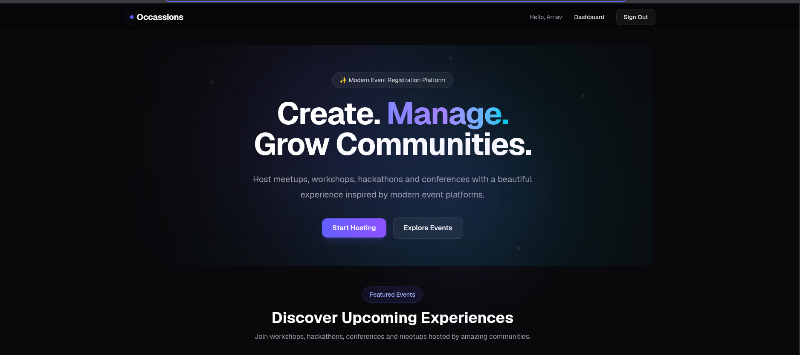
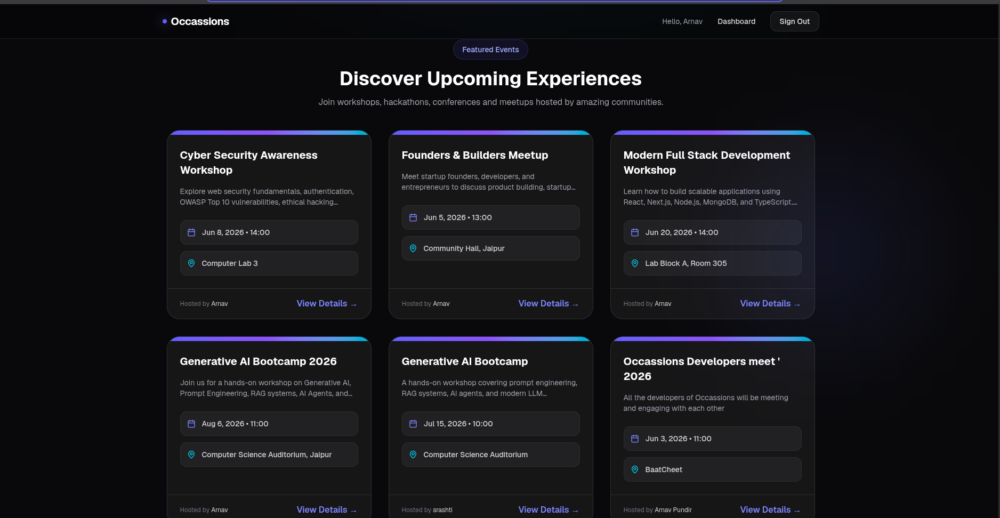
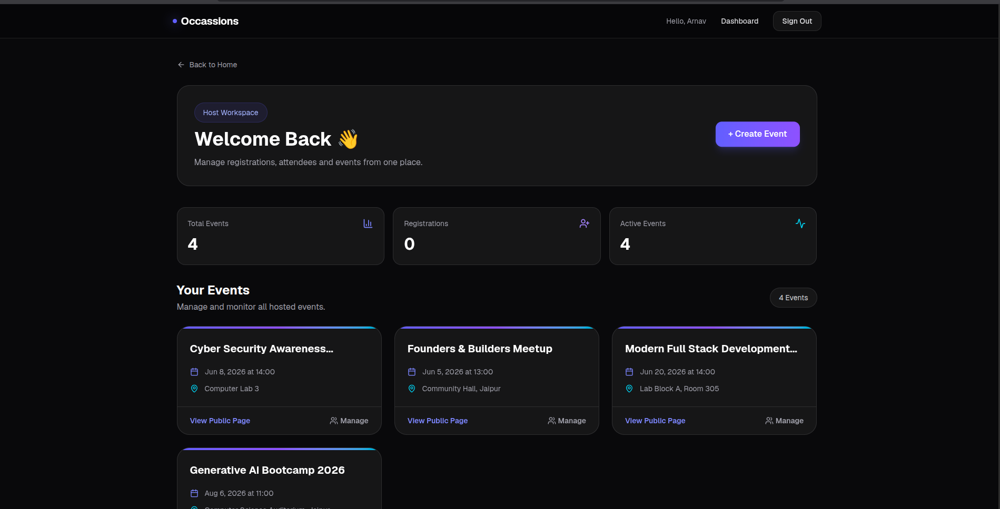
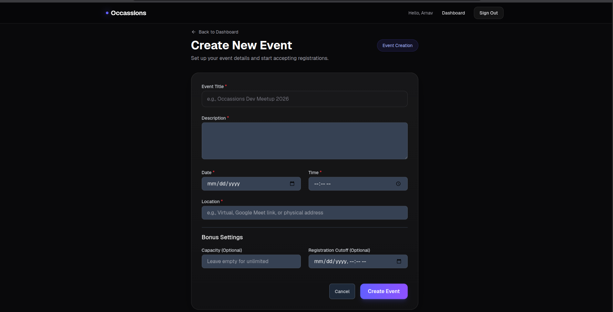
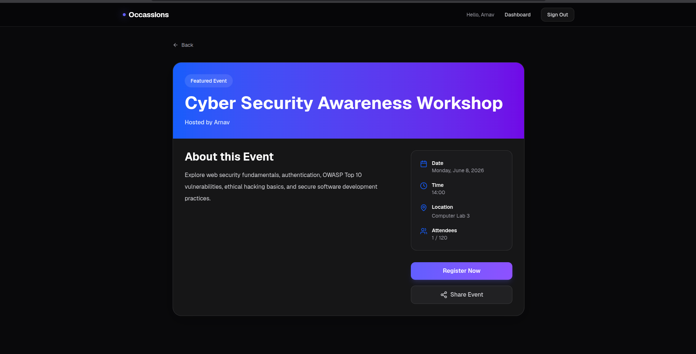
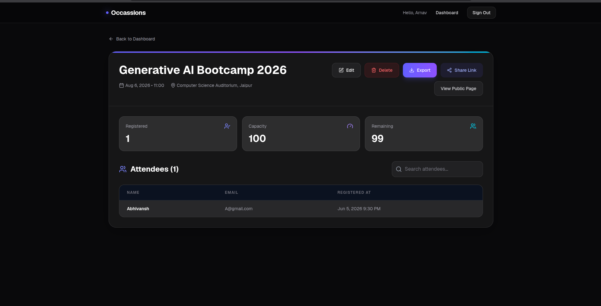

<h1 align="center">Occassions</h1>

<p align="center">
  <strong>Event Registration & Management Platform</strong>
</p>

<p align="center">
  A modern full-stack platform for creating, managing, and registering for events.
</p>

<p align="center">
  <a href="https://occassions.vercel.app">
    
  </a>
</p>

<p align="center">
  
  
  
  
  
</p>


---

## 📖 Project Overview

Occassions is a modern full-stack event management platform that enables organizers to create, manage, and monitor public events while providing attendees with a seamless registration experience.

The platform streamlines the complete event workflow, including event creation, attendee registration, capacity management, attendee tracking, and CSV exports. By centralizing these operations into a single application, Occassions removes the need for spreadsheets, forms, and manual attendee management.

Developed using the technology stack specified in the Byamn Summer Web Development Internship 2026 assessment, the project focuses on scalability, security, and user experience.

---


## ✨ Features

### Host Features

- Secure Authentication
- Protected Dashboard
- Create Events
- Edit Events
- Delete Events
- View Event Registrations
- Search Attendees
- CSV Export
- Shareable Public Event Links

### Attendee Features

- Browse Public Events
- View Event Details
- Register for Events
- Login & Authentication
- View Registered Events

### Additional Features

- Duplicate Registration Prevention
- Event Capacity Limits
- Registration Cutoff Dates
- Live Attendee Count
- Responsive Design
- Role-Based Access Control

---

# 📸 Screenshots

---

## 🏠 Home Page

The landing page introduces the platform and highlights upcoming events.



---

## 🔍 Event Discovery

Browse all publicly available events with essential information.



---

## 📊 Host Dashboard

Manage hosted events and monitor registrations from a centralized dashboard.



---

## ➕ Create Event

Create new events with scheduling, capacity, and registration settings.



---

## 🎟️ Public Event Page

A dedicated public page for each event containing complete details and registration options.



---

## 👥 Event Management

View attendees, search registrations, and export attendee lists.



---

## 📚 Documentation

To keep this README concise and easy to navigate, detailed documentation has been organized into dedicated guides covering architecture, APIs, features, and deployment.

### Available Documentation

| Document                                                   | Description                                                                                                                                        |
| ---------------------------------------------------------- | -------------------------------------------------------------------------------------------------------------------------------------------------- |
| **[Features Guide](docs/FEATURES.md)**                     | Comprehensive overview of all implemented features, including authentication, event management, registrations, dashboards, and bonus enhancements. |
| **[Architecture & Database Design](docs/ARCHITECTURE.md)** | System architecture, database schema, folder structure, and key design decisions.                                                                  |
| **[API Reference](docs/API.md)**                           | Detailed documentation for all REST API endpoints built with Next.js Route Handlers.                                                               |
| **[Deployment Guide](docs/DEPLOYMENT.md)**                 | Step-by-step instructions for deploying the application using Vercel and MongoDB Atlas.                                                            |


---

## 📁 Project Structure

```text
src
├── app
│   ├── api
│   ├── dashboard
│   ├── attendee
│   ├── events
│   ├── login
│   └── register
│
├── components
│
├── lib
│
├── models
│
└── providers
```


---


## 🚀 Getting Started

### Prerequisites

- Node.js 18+
- npm
- MongoDB Atlas or Local MongoDB

### Clone Repository

```bash
git clone https://github.com/ArnavPundir22/Occassions.git

cd Occassions
```

### Install Dependencies

### Install Dependencies

### Configure Environment Variables

Create a `.env.local` file:

```env
MONGODB_URI=

NEXTAUTH_SECRET=

NEXTAUTH_URL=http://localhost:3000
```

### Start Development Server

```bash
npm run dev
```

Open:

```text
http://localhost:3000
```

---

## 🔮 Future Enhancements

Potential improvements planned for future iterations:

- Email Notifications & Reminders
- Calendar Integration
- Event Analytics Dashboard
- QR Code Based Check-In
- Paid Event Support
- Ticket Generation
- Social Sharing Enhancements
- Multi-Organizer Support

---

## 🎓 Internship Information

This project was developed as part of the:

**Byamn Summer Web Development Internship 2026**

Track: Full Stack Web Development

Role: Full Stack Web Developer

---

## 🌐 Links

- **Live Demo:** https://occassions.vercel.app/
- **GitHub Repository:** https://github.com/ArnavPundir22/Occassions
  
---


## 👨‍💻 Author

### Arnav Pundir

Full Stack Developer


---
