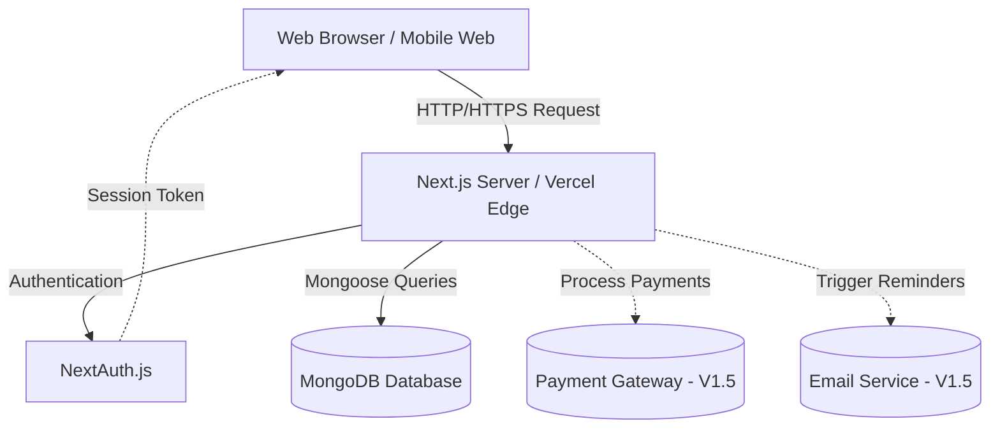

# System Architecture Document (SAD) - Occassions

## 1. System Overview
Occassions is designed to be a highly available, robust event registration system. The system architecture leverages serverless edge functions and a centralized NoSQL database to quickly serve dynamic content to attendees while providing real-time data exports to hosts.

## 2. High-Level Architecture Diagram

## 3. Data Flow & State Management
- **Client-Side State:** Kept minimal. Ephemeral UI state (modals, forms) managed via React `useState` and `useForm`. Toast notifications for feedback.
- **Server-Side State:** The single source of truth is MongoDB. Next.js Server Components fetch data directly from the DB at render time, ensuring attendees always see up-to-date capacity counts.
- **Authentication Flow:** 
  1. User requests login.
  2. NextAuth handles the session lifecycle, storing session tokens securely in HTTP-only cookies.
  3. API routes validate the session token before allowing CRUD operations on events or accessing attendee lists.

## 4. Deployment Architecture (Recommended)
- **Hosting Platform:** Vercel (Optimized for Next.js 16).
- **Database Hosting:** MongoDB Atlas (Cloud Database).
- **Static Assets:** Hosted on Vercel Edge Network (CDN).
- **Scaling Strategy:** Next.js API routes scale horizontally automatically on Vercel's serverless infrastructure, managing high-traffic event launches without manual intervention.

## 5. Security Architecture
- **Data Protection:** Passwords securely hashed using `bcryptjs`.
- **API Security:** All API routes interacting with sensitive data (e.g., guest lists, event deletion) are protected by NextAuth middleware, enforcing Role-Based Access Control (RBAC).
- **Concurrency Control:** MongoDB handles atomic updates for capacity limits, preventing double-booking race conditions during high-demand event registrations.
